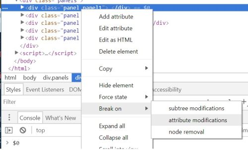

# Chrome Dev Tools tips

## Adding Breakpoint on element attribute change

In DevTools Elements panel, right click on an element (or click on the three dots to the left of the element), then select Break on > Attribute change.

To the left of the element, you should now see a small circle indicating a DOM breakpoint.  Additionally, you should now see the breakpoint listed under DOM Breakpoints.

Now, whenever one of the element attributes change then DevTools will pause on the line making the change.

To remove the breakpoint go back to the Elements panel, and repeat the Break On > Attribute Change select (you should see a tick next to this breakpoint).  Alternatively, on the DOM Breakpoints panel untick this breakpoint, this leaves it listed, which allows you to easily reset it later.

## Displaying details of last element/object selected using $0-$4

The last 5 recently inspected DOM elements or JavaScript heap objects are temporarily stored in variables for easy access: $0 - $4.

## Get last return value using $_

The output of the last evaluated expression is stored in variable $_

## Console

As well as the most common `console.log('message')` you can also used warning messages:
`console.warn('Warning')` or errors: `console.error('Error')`

### Format specifiers - inserting values

You can use format specifiers such as `%s` (strings) or `%d` (integers) to insert values into an output string, ofr instance  
`console.log('This is %s number %i', 'test', 1)`  
to output  
`This is test number 1`.

### Format specifiers - styling output

The CSS format specifier `%c` allows you to format the console output, for instance `console.log('%cThis output will be styled', 'color:purple; font-weight:bold')`

### Testing using assert

console.assert() conditionally displays an error message (second parameter) if the first parameter evaluates to false.  For example `console.assert('red'==='blue', 'An error!')`

### Clear console

To clear the console you can click no the second icon above the console, use command `Ctrl+L` or use command `console.clear()`

### Console dir

The `console.dir()` command allows you to view an object or element as a JavaScript object and inspect its properties.
Note you can also use the alias `dir()`.

### Grouping / Collapsed group

Related output can be grouped together using the group commands.  The output can be auto-collapsed using the groupCollapsed command instead.
Use console.group(), passing in a parameter naming the group, to start the group and console.groupEnd() once done:

`console.group('This is the start of a group')`  
`console.log('hello')`  
`console.groupEnd()`

### Counting

Use `console.count(<identifier>)` to display a running count of how many times that identifier has been displayed.

### Timing

The `console.time(<identifier>)` and `console.timeEnd(<identifier>)` commands give an easy method to time how long a section of code take to run.

### Console Table

The `console.table()` gives you a formatted display of objects and arrays. When called, it will take the properties of an object and create a header. The row data then comes from each index's properties value.

### Storing the output

Right-click and select save as to save the output of the console to a log file.

### Trace

The `console.trace()` command will print the current JavaScript call stack.

## Selecting elements from the console

The console provides shortcuts for selecting elements `$()` for `document.querySelector()` and  `$$()` for `document.querySelectorAll()`

## Inspecting and element or JavaScript reference

The `inspect(<object>)` command will take you to either the Elements panel, displaying the selected element or to the Profile panel, displaying the selected JavaScript reference.

## Listing event listers for an object

To see event listeners attached to an element, you can either view the Event Listeners section on the Elements panel or use the `getEventListeners(<object>)` command.

## Copy to clipboard

The copy() command will copy a string representation of the specified object to the clipboard, for instance `copy($0)`

## Getting object keys and values

The `keys(<object>)` and `values(<object>)` commands will return an array of an object keys or values.

## Monitoring functions

Use the command `monitor(<function name>` to watch a function, this will print the function name and any arguments that are passed every time it is called.

Use `unmonitor(<function name>)` to cease monitoring.
